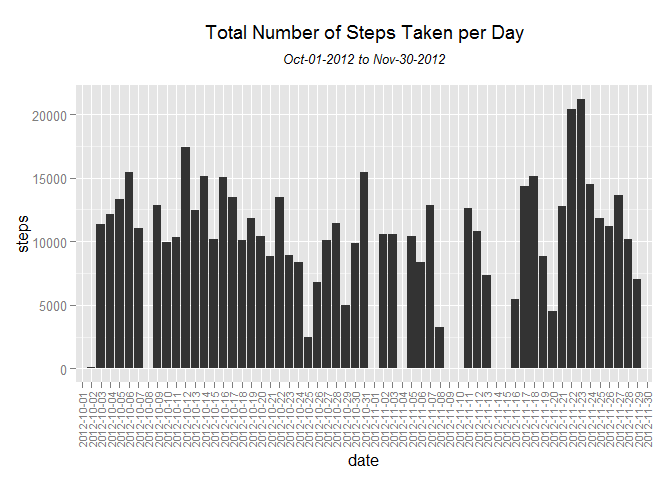
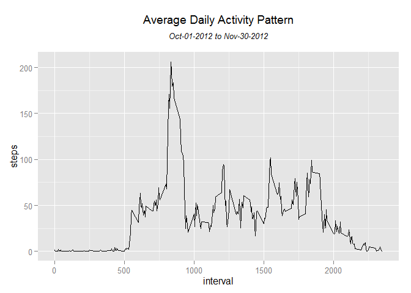

# Reproducible Research - Assignment 1
Chuong Hoang  
Sunday, February 15, 2015  

###Loading and preprocessing the data


```r
activity <- read.csv("activity.csv")
```

###Problem 1 - What is mean total number of steps taken per day?
**1. Calculate the total number of steps taken per day**


```r
tt_step <- aggregate(activity$steps, by = list(activity$date),FUN = "sum",na.rm=TRUE)
names(tt_step) <- c("date","steps")
```

**2. Make a histogram of the total number of steps taken each day**


```r
library(ggplot2)
ggplot(tt_step, aes(date, steps)) + 
  geom_bar(stat = "identity", ) +
  theme(axis.text.x=element_text(angle=90,hjust=1,vjust=0.5, size=8)) +
  ggtitle(expression(atop("Total Number of Steps Taken per Day", atop(italic("Oct-01-2012 to Nov-30-2012")))))
```

 

**3. Calculate and report the mean and median of the total number of steps taken per day**

*Calculate*


```r
tt_step_mean <- mean(tt_step$steps)
tt_step_median <- median(tt_step$steps)
```

*Report*

- Mean of the total number of steps taken per day is ***9354.2295082***
- Median of the total number of steps taken per day is ***10395***

###Problem 2 - What is the average daily activity pattern?

**1. Make a time series plot of the 5-minute interval (x-axis) and the average number of steps taken, averaged across all days (y-axis) **


```r
avg_acrs_all_day <- aggregate(activity$step, by = list(activity$interval),FUN = "mean",na.rm=TRUE)
names(avg_acrs_all_day) <- c("interval", "steps")
ggplot(avg_acrs_all_day, aes(interval, steps)) + 
  geom_line() + 
  ggtitle(expression(atop("Average Daily Activity Pattern", atop(italic("Oct-01-2012 to Nov-30-2012")))))
```

 

**2. Find 5-minute interval, on average across all the days in the dataset, contains the maximum number of steps**


```r
highest_interval <- avg_acrs_all_day[avg_acrs_all_day$steps == max(avg_acrs_all_day$steps),"interval"]
```

*Report:* The 5-minute interval contains the maximum number of steps is ***835***
