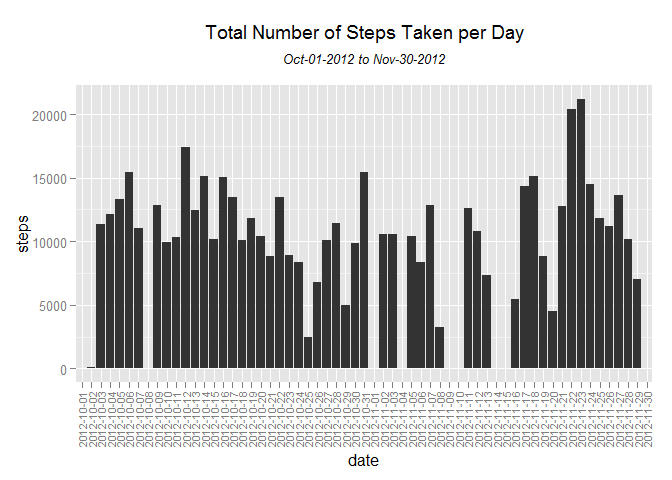
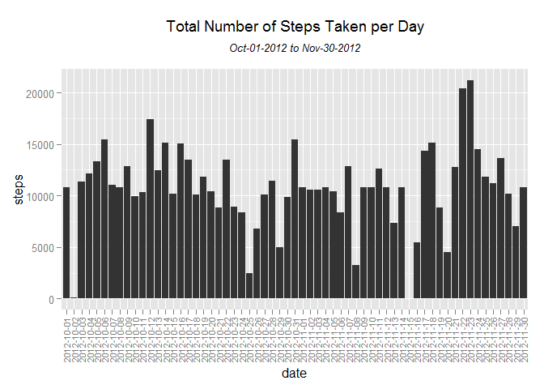
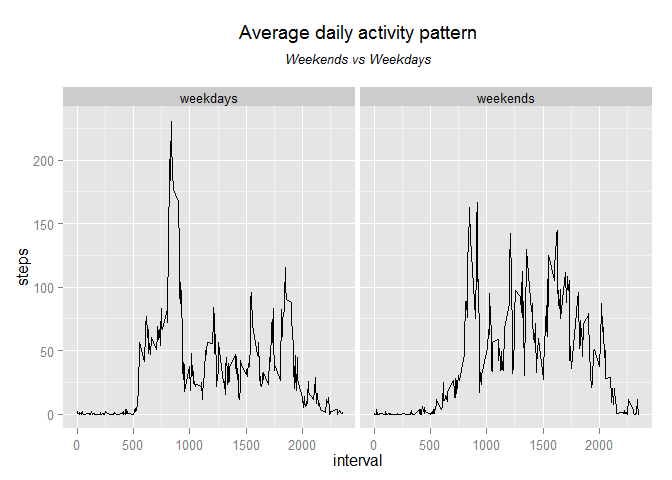

# Reproducible Research - Assignment 1
Chuong Hoang  
Sunday, February 15, 2015  

###Loading and preprocessing the data


```r
activity <- read.csv("activity.csv")
```

###Problem 1 - What is mean total number of steps taken per day?
**1. Calculate the total number of steps taken per day**


```r
tt_step1 <- aggregate(activity$steps, by = list(activity$date),FUN = "sum",na.rm=TRUE)
names(tt_step1) <- c("date","steps")
```

**2. Make a histogram of the total number of steps taken each day**


```r
library(ggplot2)
ggplot(tt_step1, aes(date, steps)) + 
  geom_bar(stat = "identity", ) +
  theme(axis.text.x=element_text(angle=90,hjust=1,vjust=0.5, size=8)) +
  ggtitle(expression(atop("Total Number of Steps Taken per Day", atop(italic("Oct-01-2012 to Nov-30-2012")))))
```

 

**3. Calculate and report the mean and median of the total number of steps taken per day**

*Calculate*


```r
tt_step1_mean <- mean(tt_step1$steps)
tt_step1_median <- median(tt_step1$steps)
```

*Report*

- Mean of the total number of steps taken per day is ***9354.2295082***
- Median of the total number of steps taken per day is ***10395***

###Problem 2 - What is the average daily activity pattern?

**1. Make a time series plot of the 5-minute interval (x-axis) and the average number of steps taken, averaged across all days (y-axis) **


```r
avg_acrs_all_day <- aggregate(activity$step, by = list(activity$interval),FUN = "mean",na.rm=TRUE)
names(avg_acrs_all_day) <- c("interval", "steps")
ggplot(avg_acrs_all_day, aes(interval, steps)) + 
  geom_line() + 
  ggtitle(expression(atop("Average Daily Activity Pattern", atop(italic("Oct-01-2012 to Nov-30-2012")))))
```

 

**2. Find 5-minute interval, on average across all the days in the dataset, contains the maximum number of steps**


```r
highest_interval <- avg_acrs_all_day[avg_acrs_all_day$steps == max(avg_acrs_all_day$steps),"interval"]
```

*Report:* The 5-minute interval contains the maximum number of steps is ***835***

###Problem 3 - Imputing missing values

**1. Calculate and report the total number of missing values in the dataset (the total number of rows with NAs)**

*Calculate*


```r
tt_num_missing_values <- sum(is.na(activity$steps))
```

*Report:* The total number of missing values in the dataset is ***2304***


**2 & 3. Devise a strategy for filling in all of the missing values in the dataset.And create a new dataset with the missing data filled in**
- Author select **the mean for that 5-minute interval** as the filling strategy
_ **the mean for that 5-minute interval** can be infer from problem 2 with dataset **avg_acrs_all_day**

*Calculate*


```r
# Initialize filled dataset same as activity dataset
filled_dataset <- activity 

# Return interval values corresponding to NA steps in activity dataset
na_intervals <- activity[is.na(activity$steps),"interval"]

# Replace NA steps in filled_dataset by the average for that interval in avg_acrs_all_day dataset
filled_dataset[is.na(filled_dataset$steps),"steps"] <- avg_acrs_all_day[match(na_intervals,avg_acrs_all_day$interval),"steps"]
```

**4.1 Make a histogram of the total number of steps taken each day**


```r
tt_step2 <- aggregate(filled_dataset$steps, by = list(filled_dataset$date),FUN = "sum",na.rm=TRUE)
names(tt_step2) <- c("date","steps")

ggplot(tt_step2, aes(date, steps)) + 
  geom_bar(stat = "identity", ) +
  theme(axis.text.x=element_text(angle=90,hjust=1,vjust=0.5, size=8)) +
  ggtitle(expression(atop("Total Number of Steps Taken per Day", atop(italic("Oct-01-2012 to Nov-30-2012")))))
```

 

**4.2 Calculate and report the mean and median total number of steps taken per day**


```r
tt_step2_mean <- mean(tt_step2$steps)
tt_step2_median <- median(tt_step2$steps)
```

*Report*

- Mean of the total number of steps taken per day is ***1.0766189\times 10^{4}***
- Median of the total number of steps taken per day is ***1.0766189\times 10^{4}***

**4.3 Do these values differ from the estimates from the first part of the assignment?**

*Answer:* Yes, these values different from the estimates in first part

**4.4 What is the impact of imputing missing data on the estimates of the total daily number of steps?**

*Answer:* 

- The mean increased : ***1411.959171***
- The median increased : ***371.1886792***

###Problem 4 - Are there differences in activity patterns between weekdays and weekends?

**1. Create a new factor variable in the dataset with two levels - "weekday" and "weekend"**


```r
datetype <- sapply(as.Date(filled_dataset$date),function(x) {if(weekdays(x) %in% c("Saturday","Sunday")) "weekends" else "weekdays"})
filled_dataset$datetype <- datetype
```

**2. Make a plot containing a time series plot of the 5-minute interval and the average number of steps taken, averaged across all weekday days or weekend days.**


```r
tt_step3 <- aggregate(filled_dataset$steps, by = list(filled_dataset$datetype, filled_dataset$interval),FUN = "mean",na.rm=TRUE)
names(tt_step3) <- c("datetype","interval","steps")

ggplot(tt_step3, aes(interval, steps)) + facet_grid(. ~ datetype) +
  geom_line() +
  ggtitle(expression(atop("Average daily activity pattern", atop(italic("Weekends vs Weekdays")))))
```

 
